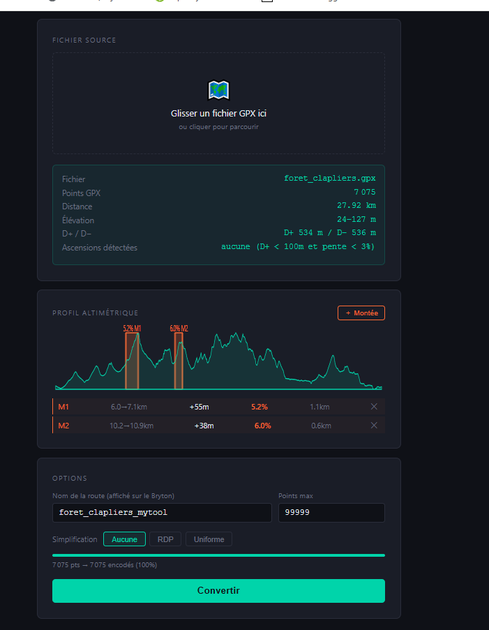

# bryton460-webapp

Outil HTML pour générer les fichiers natifs du GPS **Bryton 460** à partir d'un fichier GPX.
Conçu pour les utilisateurs PC sans l'appli Bryton officielle (Nokia, PC only, etc.).

**Unofficial tool — not affiliated with Bryton.**
File formats obtained by reverse engineering for interoperability purposes.
Licensed under the [MIT License](LICENSE).

**→ Demo : [dev.agriscope.fr/bryton.html](https://dev.agriscope.fr/bryton.html)**



---

## Utilisation

1. Ouvrir `proto_html/bryton.html` dans Chrome ou Edge
2. Glisser un fichier `.gpx`
3. Télécharger le `.zip` → dézipper dans `Tracks\` sur le Bryton (USB mass storage)

---

## Format généré

| Fichier | Contenu |
|---|---|
| `<nom>.smy` | Résumé : bbox, nb points, distance, D+ |
| `<nom>.tinfo` | Marqueurs début/fin de chaque montée |
| `<nom>.track` | Trace : lat, lon, altitude, pente par point |
| `<nom>/dupli.track` | Copie de la trace (requis par le firmware) |
| `<nom>/list.junc` + `list2.junc` | Intersections / virages |
| `<nom>/<nom>.climb` | Données des montées (distance, longueur, D+, %) |
| `<nom>/sort1.path` | Index de segments géographiques |

---

## Release notes

### v0.2 — 2026-06-25

- **`.track` byte 10 : pente locale** — Chaque point encode maintenant la pente en % (int8 signé),
  calculée sur une fenêtre glissante de 200m. Validé contre les fichiers officiels Bryton : écart ≤ 1%.
- **`.smy` : D- = 0** — L'appli officielle Bryton ne remplit pas le champ D−. Conformité corrigée.
- **Détection des montées** — Remplacement du lissage médian (par nombre de points) par une moyenne
  glissante distance-based (200m). Le médian créait des paliers artificiels qui faisaient rater les
  départs de montée. Nouveaux seuils : longueur ≥ 500m, D+ ≥ 25m, pente ≥ 2.2%, score = grade × D+.

### v0.1 — 2026-06-25

- Version proto initiale : page HTML autonome, conversion GPX → zip Bryton 460
- Génération des 8 fichiers du format natif : `.smy`, `.tinfo`, `.track`, `dupli.track`,
  `list.junc`, `list2.junc`, `.climb`, `sort1.path`
- Simplification RDP / uniforme optionnelle
- Fetch élévation SRTM via Open-Elevation API si le GPX n'a pas d'altitude
- Transfert direct USB via File System Access API (Chrome/Edge)

---

## Philosophie du format — tout est pré-calculé

Le Bryton 460 embarque un processeur ARM bas de gamme (quelques dizaines de MHz, ~1 Mo de RAM).
Pas de trigonométrie, pas de parsing, pas d'allocation mémoire dynamique en temps réel.
Tout le travail lourd est fait **côté PC à la conversion** — le device ne fait que lire et afficher.

| Valeur | Calculée où | Stockée comment |
|---|---|---|
| Pente locale | PC — fenêtre glissante 200m | `int8` signé dans byte 10 du `.track` |
| Bearing aux intersections | PC — formule haversine | `uint8` 0–255 dans `list.junc` (pas de degrés, pas de radians) |
| Bounding box / distance / D+ | PC | `.smy` — 68 octets fixes |
| Index des montées | PC — détection par profil | `.tinfo` — paires ptIdx début/fin |
| Index spatial par tuile | PC — calcul Mercator z=13 | `sort1.path` |

### Détection "sur le trajet" en deux étapes

Le Bryton ne compare pas la position GPS aux 15 000 points de la trace à chaque seconde.
Il utilise `sort1.path` comme filtre grossier :

```
Étape 1 — filtre rapide (sort1.path)
  GPS → tuile OSM z=13 courante
  → charge uniquement les ~500 points du segment correspondant
  → élimine les 14 500 autres points

Étape 2 — comparaison fine (.track)
  Pour chaque point du segment :
    distance(GPS, point) < seuil → sur le trajet
                                 → off route
```

Sans `sort1.path` correct (tuile_id = 0 au lieu de la vraie tuile), le Bryton déclare
immédiatement "off route" sans même regarder les coordonnées du `.track`.

### Pas de cosinus sur le device

Le bearing est stocké en **0–255** (pas en degrés) :
```
0   → Nord   64  → Est   128 → Sud   192 → Ouest
```
Le device fait un simple lookup de flèche sur un octet. C'est nous qui calculons
`atan2` + la conversion `× 256/360` à la génération des fichiers.

---

## Données de référence

```
data_references/
  100k/
    100K.gpx                    ← sortie Strava, ~100km, région Montpellier
    output_brytonofficial/      ← fichiers générés par l'appli Bryton officielle (ground truth)
    output_mytool/              ← fichiers générés par cet outil (pour comparaison)
  bales/
    bales.gpx                   ← sortie Strava, Pyrénées, départ ~1200m
```

---

## Ce qui est confirmé vs approximé

Validé par comparaison octet-à-octet avec les fichiers générés par l'appli officielle Bryton
sur une trace réelle de 100 km / 15 444 points.

| Fichier | Statut | Détail |
|---|---|---|
| `.track` lat/lon/ele | ✅ Correct | Encodage int32/uint16 LE validé |
| `.track` byte 10 pente | ✅ Correct | Écart ≤ 1% vs officiel (fenêtre 200m) |
| `.smy` | ✅ Correct | bbox, distance, D+ ok — D- = 0 comme l'officiel |
| `.tinfo` | ✅ Correct | Flags 0xBE/0xBF + ptIdx sur 16 bits |
| `.climb` structure | ✅ Correct | 4 × float32 : start_m, longueur_m, D+_m, grade |
| `sort1.path` | ✅ Correct | Segments par tuile OSM z=13 — format validé |
| `.climb` détection | 🔶 Approché | 1re montée exacte, autres ≈ ±2 km vs officiel |
| `list.junc` | 🔶 Approché | Détection par angle de virage — pas les vraies intersections OSM |
